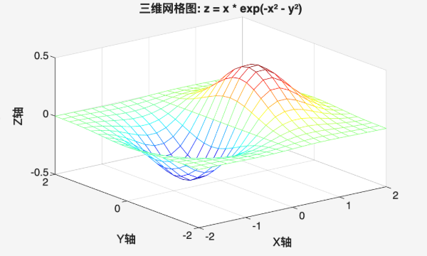

# 工程專題期中報告MATLAB程式設計
## 前言
Matlab講義第七章–握把式圖形與GUI設計、第八章–二維圖形、第九章–三維圖形、第十一章–多項式、第十六章–影像與動畫。
接觸這些單元為期2個月的時間，我透過這份工程設計的報告來彙整我這段時間的自我學習成果，
這次選定的主題圍繞著第八章–二維圖形、第九章–三維圖形以及第十六章–影像與動畫，我認為這些主題是我最渴望去探索的，我覺得十分有趣。

## 實作
### 主題一、行星系統模擬
- 大綱

將物理學、數學還有地球科學結合，製作一個由二維圖形進行延伸的實際例子，繪製出一個簡化版本的行星繞行太陽的動畫，
透過這樣的製作方式與討論出來的結果，我認為這樣的程式碼不但可以減輕老師對於這單元的負擔，
不需要透過多顆球體的實際模擬也可以觀察出八大行星中每個行星對於太陽系運轉的不同。

- 實作
<details>
  <summary>八大行星動畫模擬</summary>
  
  ```cpp
  function multi_planet_animation_8planets
  % 八大行星動畫模擬 - 簡化兼容版本
  close all; clear; clc;
  % 基本參數
  GM = 1.0;  % 太陽重力參數
  dt = 0.005;
  n_steps = 500;
  % 定義行星參數 - 使用矩陣而不是單元陣列
  % [x0, y0, vx0, vy0, 大小]
  planet_params = [
     0.4, 0.0, 0.0, 1.2, 6;    % 水星
     0.7, 0.0, 0.0, 0.95, 8;   % 金星
     1.0, 0.0, 0.0, 0.85, 10;  % 地球
     1.5, 0.0, 0.0, 0.7, 9;    % 火星
     3.0, 0.0, 0.0, 0.45, 20;  % 木星
     5.5, 0.0, 0.0, 0.35, 18;  % 土星
     8.0, 0.0, 0.0, 0.28, 15;  % 天王星
     11.0, 0.0, 0.0, 0.22, 15; % 海王星
  ];
  planet_names = {'水星', '金星', '地球', '火星', '木星', '土星', '天王星', '海王星'};
  n_planets = size(planet_params, 1);
  % 顏色定義
  colors = [
     0.6 0.6 0.6;   % 水星 - 灰色
     0.9 0.7 0.3;   % 金星 - 金黃色
     0.1 0.3 0.8;   % 地球 - 藍色
     0.8 0.3 0.2;   % 火星 - 紅色
     0.8 0.6 0.4;   % 木星 - 棕色
     0.9 0.8 0.5;   % 土星 - 土黃色
     0.6 0.8 0.9;   % 天王星 - 淡藍色
     0.2 0.3 0.8;   % 海王星 - 深藍色
  ];
  % 初始化軌道數據
  x = zeros(n_steps, n_planets);
  y = zeros(n_steps, n_planets);
  vx = zeros(n_steps, n_planets);
  vy = zeros(n_steps, n_planets);
  % 設置初始條件
  for p = 1:n_planets
     x(1, p) = planet_params(p, 1);
     y(1, p) = planet_params(p, 2);
     vx(1, p) = planet_params(p, 3);
     vy(1, p) = planet_params(p, 4);
  end
  % 計算軌道
  fprintf('計算八大行星軌道中...\n');
  for i = 1:n_steps-1
     for p = 1:n_planets
         r = sqrt(x(i, p)^2 + y(i, p)^2);
         if r < 0.1
             r = 0.1;
         end
         ax = -GM / (r^3) * x(i, p);
         ay = -GM / (r^3) * y(i, p);
        
         vx(i+1, p) = vx(i, p) + ax * dt;
         vy(i+1, p) = vy(i, p) + ay * dt;
         x(i+1, p) = x(i, p) + vx(i, p) * dt;
         y(i+1, p) = y(i, p) + vy(i, p) * dt;
     end
  end
  % 創建動畫
  fprintf('開始八大行星動畫...\n');
  figure(1);
  clf;
  hold on;
  axis equal;
  grid on;
  xlim([-12, 12]);
  ylim([-12, 12]);
  title('太陽系八大行星模擬');
  % 繪製太陽
  plot(0, 0, 'ro', 'MarkerSize', 25, 'MarkerFaceColor', 'y');
  % 動畫循環 - 使用最簡單的繪圖方法
  for i = 1:10:n_steps  % 每10步更新一次，加快動畫速度
     % 清除上一幀（除了太陽）
     cla;
    
     % 重新繪製太陽
     plot(0, 0, 'ro', 'MarkerSize', 25, 'MarkerFaceColor', 'y');
     text(0, 0.8, '太陽', 'Color', 'r', 'FontSize', 12, 'HorizontalAlignment', 'center');
    
     % 繪製所有行星
     for p = 1:n_planets
         % 繪製軌跡
         plot(x(1:i, p), y(1:i, p), 'Color', colors(p,:), 'LineWidth', 1);
        
         % 繪製行星位置 - 使用最簡單的語法
         plot(x(i, p), y(i, p), 'o', 'MarkerSize', planet_params(p,5), ...
              'MarkerFaceColor', colors(p,:), 'MarkerEdgeColor', 'k');
        
         % 添加行星名稱
         text(x(i, p)+0.5, y(i, p)+0.5, planet_names{p}, ...
              'Color', colors(p,:), 'FontSize', 9);
     end
    
     title(sprintf('太陽系八大行星模擬 - 時間: %.1f 年', i*dt*10));
     drawnow;
     pause(0.05);
  end
  % 繪製最終軌道圖
  figure(2);
  clf;
  hold on;
  axis equal;
  grid on;
  xlim([-12, 12]);
  ylim([-12, 12]);
  title('八大行星最終軌道');
  % 繪製太陽
  plot(0, 0, 'ro', 'MarkerSize', 30, 'MarkerFaceColor', 'y');
  text(0, 1.0, '太陽', 'Color', 'r', 'FontSize', 14, 'HorizontalAlignment', 'center');
  % 繪製所有軌道
  for p = 1:n_planets
     plot(x(:, p), y(:, p), 'Color', colors(p,:), 'LineWidth', 1.5);
     plot(x(end, p), y(end, p), 'o', 'MarkerSize', planet_params(p,5), ...
          'MarkerFaceColor', colors(p,:), 'MarkerEdgeColor', 'k');
     text(x(end, p)+0.8, y(end, p)+0.8, planet_names{p}, ...
          'Color', colors(p,:), 'FontSize', 11);
  end
  % 顯示軌道資訊
  fprintf('\n八大行星軌道資訊:\n');
  fprintf('====================\n');
  for p = 1:n_planets
     distances = sqrt(x(:, p).^2 + y(:, p).^2);
     avg_distance = mean(distances);
     fprintf('%s: 平均軌道半徑 = %.2f\n', planet_names{p}, avg_distance);
  end
  fprintf('八大行星模擬完成！\n');
  end
  function image_slideshow_demo()
  % 影像幻燈片演示函數
  % 用法：直接呼叫即可執行
     % 創建多個測試影像
     images = create_test_images();
    
     % 播放幻燈片
     play_slideshow(images);
  end
  function images = create_test_images()
  % 創建測試影像集
     % 第一張影像 - 漸變色
     img1 = zeros(200, 300, 3);
     for i = 1:3
         img1(:,:,i) = repmat(linspace(0,1,300), 200, 1);
     end
     % 第二張影像 - 圓形
     [xx, yy] = meshgrid(1:300, 1:200);
     img2 = zeros(200, 300, 3);
     r = sqrt((xx-150).^2 + (yy-100).^2);
     img2(:,:,1) = r < 50;  % 紅色圓形
     % 第三張影像 - 條紋
     img3 = zeros(200, 300, 3);
     img3(:,:,2) = repmat(mod(1:300, 20) < 10, 200, 1);  % 綠色條紋
    
     % 第四張影像 - 漸變圓
     img4 = zeros(200, 300, 3);
     img4(:,:,3) = exp(-((xx-150).^2 + (yy-100).^2) / 2000);  % 藍色高斯分佈
     images = {img1, img2, img3, img4};
  end
  function play_slideshow(images)
  % 播放影像幻燈片
  % 輸入：images - 包含影像的cell array
     figure('Position', [100, 100, 800, 600]);
    
     for i = 1:length(images)
         % 顯示當前影像
         imshow(images{i});
         title(['影像 ', num2str(i), '/', num2str(length(images))]);
         pause(1);  % 暫停1秒
        
         % 添加淡入淡出效果（除了最後一張）
         if i < length(images)
             fade_transition(images{i}, images{i+1});
         end
     end
    
     % 結束訊息
     msgbox('幻燈片播放完畢！', '完成');
  end
  function fade_transition(img_out, img_in)
  % 淡入淡出轉場效果
  % 輸入：img_out - 淡出影像
  %       img_in - 淡入影像
     for alpha = 1:-0.1:0
         % 淡出當前影像
         blended_img = img_out * alpha;
         imshow(blended_img);
         title('淡出效果...');
         drawnow;
         pause(0.05);
     end
    
     for alpha = 0:0.1:1
         % 淡入下張影像
         blended_img = img_in * alpha;
         imshow(blended_img);
         title('淡入效果...');
         drawnow;
         pause(0.05);
     end
  end
  ```
</details>


- 心得

這次在操作當中我透過與Deepseek的深度結合，我繪製出了一個行星系統的模擬。我結合真實物理當中的理論，例如：所有行星受太陽引力影響、可選行星間引力相互作用、不同的軌道速度與半徑…，在這個操作程式碼的過程當中，我們有進行視覺化改進，不同顏色和大小的行星、軌跡跟蹤、實際時間的顯示以及圖例標示。在輸入指令的時候，我設想了許多可以執行的實際例子，但是後來，我想要結合地球科學所以我選用了繪製出一個行星系統的模擬程式碼，這樣不僅可以幫助我在地球科學上面更加得心應手，也可以幫助我更加了解宇宙的奧妙，在繪製的過程當中，我遇到了諸多的困難與難題。

### 主題二、各種三維圖形的繪製
- 大綱
  
上網查詢許多可以執行的實際例子，挑選了三個可以繪製出三維圖形的程式碼，第一個是繪製三維曲面圖，利用到的公式為z = sin(x) + cos(y)，另外利用上課學到的內容xlabel\ylabel等繪製出x/y/z軸。第二個是繪製三維網格圖，與前面那張圖唯一不同的是運用到的公式為z = x .* exp(-x.^2 - y.^2)，最後，第三個圖是繪製三維等高線圖，公式是運用z = x.^2 + y.^2，如圖所示，繪製20條等高線。     

- 實作
<details>
    <summary>三維曲面圖</summary>
    
```cpp
  [x, y] = meshgrid(-3:0.1:3, -3:0.1:3);
  z = sin(x) + cos(y);
  figure;
  surf(x, y, z);
  title(‘三維曲面圖: z = sin(x) + cos(y)');
  xlabel('X軸');
  ylabel('Y軸');
  zlabel('Z軸');
  colorbar;
  shading interp; % 平滑著色
```

</details>


 <details>
    <summary>三維網格圖</summary>
   
```cpp
  [x, y] = meshgrid(-2:0.2:2);
  z = x .* exp(-x.^2 - y.^2);
  figure;
  mesh(x, y, z);
  title('三維網格圖: z = x * exp(-x² - y²)');
  xlabel('X軸');
  ylabel('Y軸');
  zlabel('Z軸');
  colormap(jet);
```

</details>



 <details>
    <summary>三維等高線圖</summary>
   
```cpp
  [x, y] = meshgrid(-2:0.1:2);
  z = x.^2 + y.^2;
  figure;
  contour3(x, y, z, 20); % 20條等高線
  title('三維等高線圖: z = x² + y²');
  xlabel('X軸');
  ylabel('Y軸');
  zlabel('Z軸');
  grid on;
```

</details>


- 心得

在一開始選定這個想要做的主題時，我還很迷茫可以做什麼樣式的三維圖形的延伸，然而出現太多的問題，以至於我最終未能找到一個像樣的延伸例子，我最後統整了許多上課所學到的內容，並且結合Deepseek的合作寫出了這三個圖形，雖然看似簡單的程式碼，短短10行不到，但是卻蘊含了許多老師在三維圖形的課程當中所教的東西，所以需要具備許多先備的知識不然無法正確執行出來這些程式碼。做完這兩個主題，我發現我跟Deepseek的配合度極好，先將一些自己所想到的指令輸入進去，然後Deepseek就會將所可能需要具備的程式碼或者是建議輸出給我，我再透過融會貫通即可完成這兩項主題，我到現在覺得最困難的點是如何第一次就輸入正確的程式碼，我必須透過一次又一次的確認以及重複檢視自己的程式碼是否正確，這是我認為在操作這些程式碼中最難以達成的。

### 主題三、影像幻燈片動畫
- 大綱

  本主題透過結合第十六章節的影像與動畫，一開始同樣是使用function函數，即按下Run指令就可以執行了，
  這次的主題是透過如模擬真實動畫片般將一幕又一幕的變化呈現在觀者面前，我認為這個對於一個新手在學習matlab中為最佳檢視這章節是否學習如預期最佳解。	

- 實作
<details>
    <summary>影像幻燈片動畫</summary>
    
```cpp
function image_slideshow_demo()
% 影像幻燈片演示函數
% 用法：直接呼叫即可執行
   % 創建多個測試影像
   images = create_test_images();
  
   % 播放幻燈片
   play_slideshow(images);
end
function images = create_test_images()
% 創建測試影像集
   % 第一張影像 - 漸變色
   img1 = zeros(200, 300, 3);
   for i = 1:3
       img1(:,:,i) = repmat(linspace(0,1,300), 200, 1);
   end
   % 第二張影像 - 圓形
   [xx, yy] = meshgrid(1:300, 1:200);
   img2 = zeros(200, 300, 3);
   r = sqrt((xx-150).^2 + (yy-100).^2);
   img2(:,:,1) = r < 50;  % 紅色圓形
   % 第三張影像 - 條紋
   img3 = zeros(200, 300, 3);
   img3(:,:,2) = repmat(mod(1:300, 20) < 10, 200, 1);  % 綠色條紋
  
   % 第四張影像 - 漸變圓
   img4 = zeros(200, 300, 3);
   img4(:,:,3) = exp(-((xx-150).^2 + (yy-100).^2) / 2000);  % 藍色高斯分佈
   images = {img1, img2, img3, img4};
end
function play_slideshow(images)
% 播放影像幻燈片
% 輸入：images - 包含影像的cell array
   figure('Position', [100, 100, 800, 600]);
  
   for i = 1:length(images)
       % 顯示當前影像
       imshow(images{i});
       title(['影像 ', num2str(i), '/', num2str(length(images))]);
       pause(1);  % 暫停1秒
      
       % 添加淡入淡出效果（除了最後一張）
       if i < length(images)
           fade_transition(images{i}, images{i+1});
       end
   end
  
   % 結束訊息
   msgbox('幻燈片播放完畢！', '完成');
end
function fade_transition(img_out, img_in)
% 淡入淡出轉場效果
% 輸入：img_out - 淡出影像
%       img_in - 淡入影像
   for alpha = 1:-0.1:0
       % 淡出當前影像
       blended_img = img_out * alpha;
       imshow(blended_img);
       title('淡出效果...');
       drawnow;
       pause(0.05);
   end
  
   for alpha = 0:0.1:1
       % 淡入下張影像
       blended_img = img_in * alpha;
       imshow(blended_img);
       title('淡入效果...');
       drawnow;
       pause(0.05);
   end
end
```
</details>


- 心得
  
在操作本主題的程式碼中，一開始向Deepseek提出了想要製作關於第十六章節-影像與動畫相關的實例，所以後來Deepseek提出了製造一個影像幻燈片的動畫的意見，在有限的知識量下，我認為這一個想法是最佳可執行的方法，在操作本程式的時候，並沒有遇到太大的困難，唯一想要達到的目的是將程式碼利用function來執行這次主題的程式碼，然後在本次得操作當中，我完成了製作動畫的夢想。
